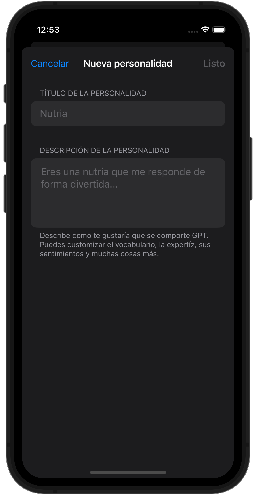

# CrackGPT

  
  
  
  

**CrackGPT** is a simple, fast, and reliable ChatGPT client for iOS 15+ and macOS 12+ equipped with some great features!

https://github.com/dancarvajc/CrackGPT/assets/71818002/04421d9a-d1d4-4340-8b6e-eb44fe6f06c5

## Features

- Enjoy special greetings from CrackGPT on the homepage—funny, sarcastic, or inspirational.
- Share complete chat sessions in PDF format.
- Accessibility!
- Craft new personalities according to your preferences.
- Code blocks supported.
- Scroll down on the Home page to start a new chat.
- Customize features at your discretion in Settings.
- Use your own token.
- Compatible with iOS 15+ and macOS 12+.

## Technical Features

- Keyboard functionality within chats mimics that of WhatsApp/Telegram, smartly adjusting the content to the current content offset and starting at the bottom. This is a challenging feat in SwiftUI, especially across various OS versions.
- CoreData is implemented to persist chats and other data locally.
- The generation of PDFs from chats was challenging to implement but is reliable and efficient.
- MVVM with separated layers for Data and Domain logic. So you can change the storage provider and the OpenAI provider easily.

## Images

#### MacOS

   
  

## To Do

- [ ] Integrate additional OpenAI APIs.
- [ ] Enhance the user interface?
- [ ] Implement unit tests.
- [ ] Add multilanguage support.

## License

MIT License

Contributions and issue reporting are welcomed. Please feel free to contribute and open issues.
